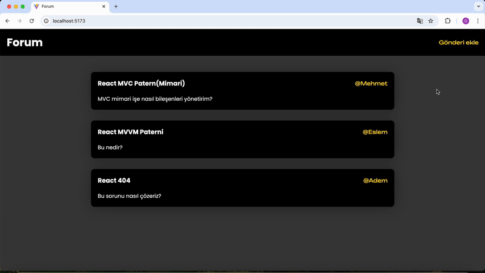

# MVC Blog Projesi

## 📌 MVC Yapısı

- **Model** → Uygulamanın veri mantığını temsil eder
  - Örn: Form state’ini tutacak obje değerleri
- **View** → Kullanıcı arayüzünü temsil eder
  - JSX kodları burada yazılır (`div`, `form`, `header` vb.)
- **Controller** → Model ve View arasındaki iletişimi sağlar
  - Kullanıcı etkileşimlerindeki fonksiyonları tutar

---

## Kullanılan Kütüphaneler

- `axios`
- `react-router-dom`
- `json-server`
- `sass`

---

## Yapılanlar

- API’den blog verileri alındı **(Controller)**
- Her blog verisi için ekrana kart basıldı **(View)**
- Bir form oluşturuldu **(View)**
  - Input değişimlerinde state güncellendi **(Controller)**
  - State’in tutacağı değerler belirlendi **(Model)**
  - Form gönderildiğinde API’ye post edildi ve yönlendirme yapıldı **(Controller)**

---

## Özellikler

- Yeni gönderi eklenebilir
- Tüm gönderiler veya Belirli bir kullanıcının gönderileri (modal ile) listelenebilir

---

## 🎥 Ekran Görüntüsü / Gif

